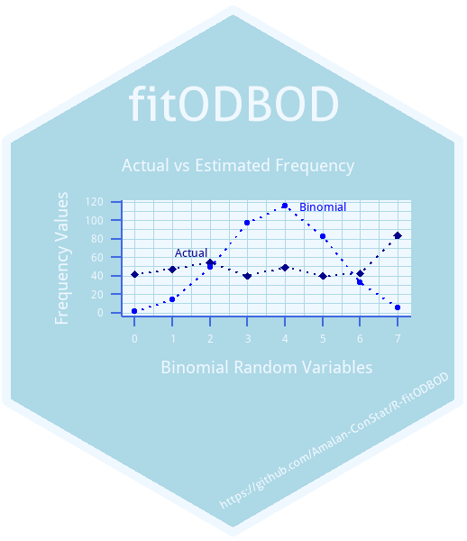

<!-- README.md is generated from README.Rmd. Please edit that file -->

# fitODBODRshiny 

<!-- badges: start -->

[](https://cran.r-project.org/package=fitODBODRshiny)
[](commits/main)
[](https://cran.r-project.org/package=fitODBODRshiny)
[](https://lbesson.mit-license.org/)

[](https://cran.r-project.org/package=fitODBODRshiny)
[](https://cran.r-project.org/package=fitODBODRshiny)
[](https://cran.r-project.org/package=fitODBODRshiny)

[](https://www.repostatus.org/#active)
[](https://lifecycle.r-lib.org/articles/stages.html#stable)
[](https://github.com/Amalan-ConStat/fitODBODRshiny/issues)

[](https://github.com/Amalan-ConStat/fitODBODRshiny)
<!-- badges: end -->

## How to engage with “fitODBODRshiny” the first time ?

``` r
## Installing the package from GitHub
devtools::install_github("Amalan-ConStat/fitODBODRshiny")

## Installing the package from CRAN
install.packages("fitODBODRshiny")
```

R package for the Application:
[Here](https://cran.r-project.org/package=fitODBODRshiny)

Current Rshiny Application:
[Here](https://amalan-con-stat.shinyapps.io/fitODBODRshiny/)

## What does this Rshiny App does ?

- Binomial Outcome data can be fitted by the binomial distribution,
  however when there is overdispersion, that is means there is
  correlation among the binomial random variables.
- That means we need better distributions to fit the overdispersed big
  data.
- These better distributions are Alternate Binomial and Binomial Mixture
  distributions.
- In this application we fit these distributions for the binomial
  outcome datasets in the R package “fitODBOD”.

### process

1.  From the seven datasets select a dataset.
2.  Based on the selection fitted results for the Alternate Binomial and
    Binomial Mixture distributions are shown in as plots in the tabs.
3.  Methods that require maximum likelihood estimation are repeated
    fifty times for accuracy and their estimated model parameters are
    also plotted.
4.  To compare the methods we use a table for each of distribution type.
5.  After observing these tables we have written a few points of the
    results, possibly the best method as well.
